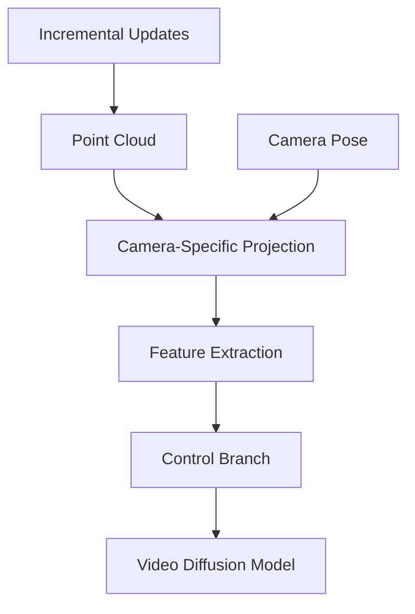

## Overview

The **global-geometric memory** is a core component of WorldStereo that enables precise camera control while injecting coarse structural priors into the video generation process. It operates through incrementally updated point clouds that represent the 3D structure of the scene.

<Note>
The global-geometric memory serves as the coarse structural backbone of WorldStereo, providing geometric guidance that ensures generated videos respect the underlying 3D scene structure.
</Note>

## Purpose and Function

### Primary Objectives

The global-geometric memory module achieves three critical objectives:

<CardGroup cols={3}>
  <Card title="Camera Control" icon="camera">
    Enables precise control over camera trajectories during video generation
  </Card>
  
  <Card title="Structural Priors" icon="cubes">
    Injects coarse 3D structural information to guide the generation process
  </Card>
  
  <Card title="View Consistency" icon="arrows-rotate">
    Maintains geometric consistency across different viewpoints
  </Card>
</CardGroup>

## Incremental Point Cloud Updates

A key innovation of the global-geometric memory is its use of **incrementally updated point clouds** rather than static representations.

### How Incremental Updates Work

<Accordion title="Point Cloud Initialization">
The point cloud is initialized from the input image (perspective or panoramic) using depth estimation or explicit depth information. This initial point cloud captures the basic 3D structure visible in the starting view.
</Accordion>

<Accordion title="Incremental Growth">
As new frames are generated along a camera trajectory, the point cloud is incrementally updated:

1. **New observations** from generated frames add points to previously unobserved regions
2. **Existing points** are refined with additional observations from different viewpoints
3. **Confidence values** are updated based on multi-view consistency

This incremental approach allows the 3D representation to grow and improve as more of the scene is explored.
</Accordion>

<Accordion title="Efficient Memory Management">
Incremental updates enable efficient memory usage:
- Only relevant regions of the scene are stored in detail
- Points can be pruned based on confidence or relevance
- The representation scales gracefully with scene complexity
</Accordion>

### Benefits of Incremental Representation

<Info>
**Computational Efficiency**: Incremental updates avoid the need to recompute the entire 3D representation from scratch at each frame, significantly reducing computational overhead.
</Info>

Additional advantages include:

- **Real-time capability**: Supports streaming video generation scenarios
- **Memory efficiency**: Only stores relevant geometric information
- **Progressive refinement**: Quality improves with more observations
- **Adaptivity**: Naturally handles scene exploration and discovery

## Coarse Structural Priors

The global-geometric memory provides **coarse structural priors** that guide the video diffusion process.

### What Are Structural Priors?

Structural priors encode:

```yaml
Geometric Information:
  - Surface positions in 3D space
  - Overall scene layout and topology
  - Depth relationships between objects
  - Spatial extent of scene elements

Coarse Level:
  - General shapes rather than fine details
  - Object boundaries and major surfaces
  - Spatial relationships between elements
  - Overall geometric consistency
```

### Injection into Generation Process

The point cloud-based structural priors influence video generation by:

1. **Conditioning the diffusion model** on geometric features derived from the point cloud
2. **Constraining plausible outputs** to those consistent with the 3D structure
3. **Guiding attention mechanisms** to geometrically relevant regions
4. **Ensuring multi-view consistency** through shared 3D representation

<Note>
While the global-geometric memory handles coarse structure, the spatial-stereo memory complements it by focusing on fine-grained details. This division of labor enables efficient processing at multiple geometric scales.
</Note>

## Precise Camera Control

The global-geometric memory is the foundation for WorldStereo's precise camera control capabilities.

### Camera Trajectory Integration

Camera control is achieved through:

<CardGroup cols={2}>
  <Card title="Camera Pose Encoding" icon="location-dot">
    Camera extrinsics (position and orientation) and intrinsics (field of view, focal length) are encoded and provided to the generation model
  </Card>
  
  <Card title="View-Dependent Rendering" icon="eye">
    The point cloud is projected to the target camera view, creating view-specific geometric features that condition the generation
  </Card>
  
  <Card title="Trajectory Consistency" icon="route">
    Sequential frames along a trajectory maintain consistency through the shared point cloud representation
  </Card>
  
  <Card title="Viewpoint Transitions" icon="arrows-left-right">
    Smooth camera movements are supported by continuous point cloud queries across viewpoints
  </Card>
</CardGroup>

### Supporting Complex Camera Motions

The global-geometric memory enables various camera motion types:

- **Orbital movements**: Rotating around objects or scenes
- **Forward/backward motion**: Moving through the scene
- **Sideways translation**: Parallel camera movements
- **Complex trajectories**: Arbitrary 6-DOF camera paths
- **Zoom operations**: Changing field of view with geometric awareness

## Point Cloud Representation

### Point Cloud Structure

Each point in the global-geometric memory stores:

```python
Point Attributes:
  position: [x, y, z]           # 3D world coordinates
  color: [r, g, b]              # RGB appearance
  normal: [nx, ny, nz]          # Surface orientation
  confidence: float              # Multi-view consistency score
  feature: [f1, f2, ..., fn]    # Learned geometric features
```

<Info>
The learned geometric features encode higher-level structural information that helps the diffusion model generate consistent content.
</Info>

### Point Cloud Processing

The point cloud undergoes several processing steps:

1. **Projection**: Points are projected to the target camera view
2. **Feature extraction**: Geometric and appearance features are computed
3. **Aggregation**: Multiple points may contribute to the same image region
4. **Encoding**: Processed features are encoded for the diffusion model

## Integration with Video Diffusion

The global-geometric memory integrates with the VDM backbone through the control branch:



### Control Signal Generation

The point cloud produces control signals that:

- Modulate the diffusion model's attention patterns
- Provide geometric conditioning at multiple layers
- Ensure geometric consistency across frames
- Guide content generation in previously unobserved regions

## Comparison with Alternative Approaches

<Accordion title="vs. Implicit Neural Representations">
**Point clouds offer**:
- Faster query and update times
- More interpretable representations
- Easier integration with traditional 3D reconstruction pipelines
- Better support for incremental updates

**Trade-offs**:
- Point clouds may require more memory for very dense representations
- Implicit representations can be more compact for smooth surfaces
</Accordion>

<Accordion title="vs. Voxel Grids">
**Point clouds offer**:
- Memory efficiency for sparse scenes
- No fixed resolution limitations
- Better handling of unbounded scenes

**Trade-offs**:
- Voxel grids provide more regular structure
- Point clouds require spatial indexing for efficient queries
</Accordion>

<Accordion title="vs. Mesh Representations">
**Point clouds offer**:
- Easier updates and modifications
- No need for explicit topology
- Better handling of incomplete or partial observations

**Trade-offs**:
- Meshes provide explicit surface connectivity
- Point clouds may have gaps between points
</Accordion>

## Technical Advantages

### Scalability

The global-geometric memory scales effectively:

- **Scene size**: Works with small objects to large environments
- **Trajectory length**: Supports short clips to long video sequences
- **Resolution**: Adapts point density to quality requirements

### Robustness

The incremental update mechanism provides robustness:

- Handles partial observations gracefully
- Recovers from temporary inconsistencies
- Improves with additional observations

### Flexibility

The design supports:

- Different input modalities (perspective, panoramic)
- Various scene types and complexities
- Integration with different VDM backbones

## Relationship with Spatial-Stereo Memory

The global-geometric and spatial-stereo memories work in tandem:

<CardGroup cols={2}>
  <Card title="Global-Geometric Memory" icon="globe">
    **Coarse structure**
    
    Handles overall scene geometry, camera control, and large-scale consistency
  </Card>
  
  <Card title="Spatial-Stereo Memory" icon="magnifying-glass">
    **Fine details**
    
    Focuses on local details, texture consistency, and fine-grained correspondences
  </Card>
</CardGroup>

<Note>
This hierarchical approach mirrors the multi-scale nature of 3D scenes and enables efficient processing by allocating computational resources appropriately at each scale.
</Note>

## Next Steps

- Learn about [Spatial-Stereo Memory](/concepts/spatial-stereo-memory) for fine-grained detail control
- Understand the [Video Diffusion Model](/concepts/video-diffusion) backbone architecture
- Explore the complete [Architecture Overview](/concepts/overview)
