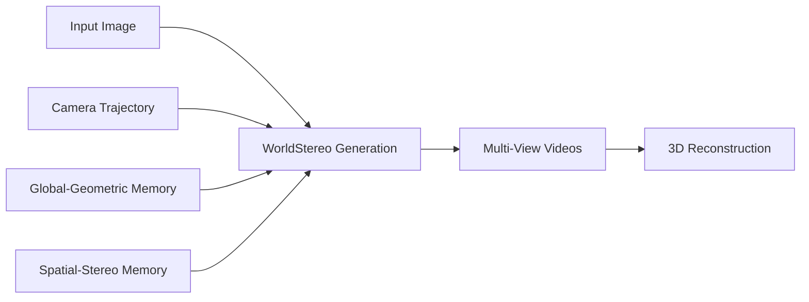

## Introduction

WorldStereo is a novel framework that bridges camera-guided video generation and 3D reconstruction through dedicated geometric memory modules. Unlike traditional Video Diffusion Models (VDMs), WorldStereo generates multi-view-consistent videos under precise camera control, enabling high-quality 3D scene reconstruction.

<Note>
WorldStereo addresses the fundamental challenge in foundational VDMs: while they produce visually impressive videos, reconstructing consistent 3D scenes from their outputs remains difficult due to limited camera controllability and inconsistent content across different camera trajectories.
</Note>

## Core Architecture

WorldStereo's architecture consists of three key components:

<CardGroup cols={2}>
  <Card title="Global-Geometric Memory" icon="globe" href="/concepts/global-geometric-memory">
    Enables precise camera control while injecting coarse structural priors through incrementally updated point clouds
  </Card>
  
  <Card title="Spatial-Stereo Memory" icon="cube" href="/concepts/spatial-stereo-memory">
    Constrains attention receptive fields with 3D correspondence to focus on fine-grained details from the memory bank
  </Card>
  
  <Card title="Video Diffusion Backbone" icon="video" href="/concepts/video-diffusion">
    Built on distribution matching distilled VDM backbone with flexible control branch-based design
  </Card>
  
  <Card title="Control Branch Design" icon="diagram-project" href="/concepts/video-diffusion#control-branch-architecture">
    Flexible control branch architecture that operates without requiring joint training
  </Card>
</CardGroup>

## Key Capabilities

### Multi-View Consistency

The geometric memory modules work together to ensure multi-view consistency:

- **Global-Geometric Memory** provides coarse structural guidance through point cloud representations
- **Spatial-Stereo Memory** refines details by constraining attention based on 3D correspondences
- Together, they enable generation of videos that maintain consistency when viewed from different camera angles

### Precise Camera Control

WorldStereo achieves precise camera control through:

1. Integration of camera parameters into the generation process
2. Incremental point cloud updates that reflect camera movements
3. 3D correspondence-based attention mechanisms

<Info>
This precise camera control is essential for facilitating high-quality 3D reconstruction from generated videos.
</Info>

### Efficiency Through Distillation

The framework demonstrates impressive efficiency by:

- Building on a **distribution matching distilled VDM backbone**
- Utilizing a **flexible control branch-based design**
- Operating **without joint training** requirements

## World Model Capabilities

<Note>
WorldStereo acts as a powerful world model, capable of tackling diverse scene generation tasks with high-fidelity 3D results.
</Note>

The framework supports:

- **Perspective image input**: Generate consistent multi-view videos from standard perspective images
- **Panoramic image input**: Process panoramic images for comprehensive scene generation
- **Diverse scene types**: Handle various scene configurations and complexities

## From Generation to Reconstruction

WorldStereo uniquely bridges the gap between video generation and 3D reconstruction:

<Accordion title="Why is multi-view consistency important?">
Multi-view consistency ensures that the same 3D scene point appears correctly across different viewpoints. Without this consistency, 3D reconstruction produces artifacts, holes, and geometric inconsistencies. WorldStereo's geometric memory modules ensure that generated videos maintain this critical property.
</Accordion>

<Accordion title="How does WorldStereo differ from standard VDMs?">
Standard Video Diffusion Models focus on visual quality but lack mechanisms for camera control and multi-view consistency. WorldStereo introduces geometric memory modules that explicitly model 3D structure, enabling both precise camera control and consistency across viewpoints—requirements for successful 3D reconstruction.
</Accordion>

## Technical Advantages

### No Joint Training Required

The control branch-based design allows WorldStereo to:
- Leverage pre-trained VDM backbones efficiently
- Add geometric control without retraining base models
- Maintain flexibility in architecture modifications

### Incremental Updates

The global-geometric memory uses incremental point cloud updates:
- Reduces computational overhead
- Enables real-time or near-real-time operation
- Supports streaming video generation

### Fine-Grained Detail Preservation

The spatial-stereo memory ensures:
- High-frequency details are preserved across views
- Texture consistency in generated videos
- Accurate surface detail reconstruction

## Next Steps

Explore each component in detail:

1. [Global-Geometric Memory](/concepts/global-geometric-memory) - Learn how point clouds guide generation
2. [Spatial-Stereo Memory](/concepts/spatial-stereo-memory) - Understand attention-based detail control
3. [Video Diffusion Model](/concepts/video-diffusion) - Dive into the backbone architecture
