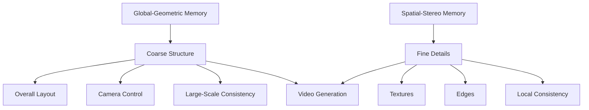

## Overview

The **spatial-stereo memory** is WorldStereo's mechanism for preserving and enforcing fine-grained details across multiple viewpoints. It operates by constraining the model's attention receptive fields using 3D correspondence information, ensuring that local details remain consistent when viewed from different camera angles.

<Note>
While the global-geometric memory handles coarse structural priors, the spatial-stereo memory specializes in fine-grained detail preservation—textures, edges, local surface variations, and other high-frequency visual information.
</Note>

## Core Concept: 3D Correspondence

### What is 3D Correspondence?

**3D correspondence** refers to the relationship between image regions across different viewpoints that observe the same physical 3D point or surface patch.


<Info>
When two pixels in different views correspond to the same 3D point, they should exhibit consistent appearance properties (color, texture) when accounting for lighting and viewing angle changes.
</Info>

### Why 3D Correspondence Matters

For multi-view-consistent video generation:

<CardGroup cols={2}>
  <Card title="Detail Consistency" icon="sparkles">
    Ensures textures and fine details appear the same across views
  </Card>
  
  <Card title="Geometric Accuracy" icon="ruler">
    Maintains precise spatial relationships at the pixel level
  </Card>
  
  <Card title="Reconstruction Quality" icon="cube">
    Enables high-quality 3D reconstruction by providing reliable correspondences
  </Card>
  
  <Card title="Temporal Stability" icon="clock">
    Prevents flickering and inconsistencies in generated video sequences
  </Card>
</CardGroup>

## Memory Bank Architecture

The spatial-stereo memory operates through a **memory bank** that stores fine-grained visual information with associated 3D correspondence data.

### Memory Bank Components

<Accordion title="Visual Features">
High-resolution feature representations extracted from previously generated frames:

```yaml
Feature Storage:
  - Multi-scale feature pyramids
  - Texture and appearance descriptors
  - Edge and corner information
  - Local pattern encodings
```

These features capture the fine-grained visual details that need to be preserved across views.
</Accordion>

<Accordion title="Geometric Metadata">
For each stored feature, the memory bank maintains:

- **3D position**: The world-space location of the feature
- **Surface normal**: Orientation of the local surface
- **View information**: Which views have observed this feature
- **Confidence scores**: Reliability of the stored information

This metadata enables accurate correspondence matching across viewpoints.
</Accordion>

<Accordion title="Correspondence Maps">
Explicit or implicit mappings that define which image regions across different views correspond to the same 3D structure:

- **Dense correspondence fields**: Pixel-to-pixel mappings
- **Sparse keypoint correspondences**: Distinctive feature locations
- **Patch-level associations**: Groups of related pixels

These maps guide the attention mechanism during generation.
</Accordion>

### Memory Bank Updates

As new frames are generated:

1. **Feature extraction**: Visual features are extracted from the new frame
2. **Correspondence computation**: 3D correspondences are established with existing memory
3. **Memory insertion**: New features and correspondences are added to the bank
4. **Consistency refinement**: Existing entries are refined with new observations

<Info>
The memory bank grows incrementally as more views are generated, continuously improving the quality and coverage of stored correspondences.
</Info>

## Attention Constraint Mechanism

The spatial-stereo memory's primary function is to **constrain the model's attention receptive fields** based on 3D correspondence.

### Traditional Attention in Video Diffusion

Standard video diffusion models use attention mechanisms that:

- Attend to all spatial and temporal locations
- Learn attention patterns from training data
- May produce inconsistent correspondences across views

### Correspondence-Constrained Attention

Spatial-stereo memory introduces geometric constraints:

```python
# Conceptual attention constraint
Attention(query, key, value):
  # Standard attention computation
  attention_weights = softmax(query @ key.T / sqrt(d))
  
  # Geometric constraint from spatial-stereo memory
  correspondence_mask = get_correspondence_mask(query_3d_pos, key_3d_pos)
  
  # Apply constraint to focus on corresponding regions
  constrained_weights = attention_weights * correspondence_mask
  
  # Compute output with geometrically-aware attention
  output = constrained_weights @ value
```

<Note>
By constraining attention to geometrically corresponding regions, the spatial-stereo memory ensures that the model focuses on relevant details from previous views when generating new frames.
</Note>

### Benefits of Constrained Attention

<CardGroup cols={2}>
  <Card title="Reduced Ambiguity" icon="crosshairs">
    Limits attention to regions that are geometrically relevant, reducing confusion
  </Card>
  
  <Card title="Detail Preservation" icon="image">
    Ensures fine details are copied from appropriate source views
  </Card>
  
  <Card title="Consistency Enforcement" icon="check-double">
    Prevents the model from hallucinating inconsistent details
  </Card>
  
  <Card title="Efficient Computation" icon="gauge-high">
    Sparse attention patterns reduce computational requirements
  </Card>
</CardGroup>

## Fine-Grained Detail Preservation

The spatial-stereo memory excels at preserving fine-grained details that are critical for visual quality and 3D reconstruction accuracy.

### Types of Details Preserved

<Accordion title="Texture Patterns">
**Surface textures** like:
- Fabric weaves
- Wood grain
- Stone patterns
- Paint details

These high-frequency patterns must remain consistent across viewpoints for realistic generation and accurate reconstruction.
</Accordion>

<Accordion title="Edges and Boundaries">
**Sharp transitions** such as:
- Object silhouettes
- Shadow boundaries
- Material transitions
- Occlusion edges

Precise edge localization across views is essential for geometric accuracy.
</Accordion>

<Accordion title="Local Surface Variation">
**Small-scale geometry** including:
- Surface bumps and indentations
- Wrinkles and folds
- Fine geometric details
- Relief patterns

These variations create realistic appearance under different viewing angles.
</Accordion>

<Accordion title="Specular Highlights">
**View-dependent effects** like:
- Reflections
- Glossy highlights
- Transparent surface appearance

While view-dependent, these effects must change consistently with viewing angle.
</Accordion>

### Detail-Preserving Mechanism

The spatial-stereo memory preserves details through:

1. **High-resolution feature storage**: Maintains detailed feature representations
2. **Precise correspondence**: Accurately maps details across views
3. **Attention guidance**: Directs the model to copy details from appropriate sources
4. **Multi-view consistency checking**: Validates detail consistency across multiple observations

## Integration with Global-Geometric Memory

The spatial-stereo and global-geometric memories form a complementary hierarchy:



### Division of Responsibilities

<CardGroup cols={2}>
  <Card title="Global-Geometric" icon="globe">
    **Scale**: Scene-level
    
    **Focus**: Coarse geometry, camera paths
    
    **Representation**: Point clouds
    
    **Updates**: Incremental 3D structure
  </Card>
  
  <Card title="Spatial-Stereo" icon="microscope">
    **Scale**: Local patches
    
    **Focus**: Fine details, textures
    
    **Representation**: Feature memory bank
    
    **Updates**: Correspondence refinement
  </Card>
</CardGroup>

<Info>
This hierarchical design allows WorldStereo to efficiently process geometric information at multiple scales, allocating computational resources appropriately for both coarse structure and fine details.
</Info>

## Attention Receptive Field Control

### What Are Attention Receptive Fields?

In video diffusion models, **attention receptive fields** define which spatial and temporal regions each location can attend to during generation.

**Unconstrained receptive fields**:
- Can attend to any location in space and time
- Learn patterns from training data
- May produce geometrically inconsistent attention

**Spatially-constrained receptive fields**:
- Attend only to geometrically corresponding regions
- Guided by 3D correspondence from spatial-stereo memory
- Enforce multi-view consistency through geometry

### How Constraints Are Applied

The spatial-stereo memory applies constraints through:

<Accordion title="Correspondence-Based Masking">
Attention masks are generated based on 3D correspondence:

```python
# For each query position
mask[query_position] = {
  key_position: is_corresponding(query_position, key_position)
  for key_position in all_positions
}
```

Only corresponding positions receive non-zero attention weights.
</Accordion>

<Accordion title="Spatial Warping">
Features from previous views are warped to the current view using correspondence:

1. Retrieve features from memory bank
2. Use 3D correspondence to warp to current view
3. Use warped features as keys/values in attention

This provides geometrically-aligned features for attention computation.
</Accordion>

<Accordion title="Adaptive Receptive Fields">
Receptive field sizes adapt based on:
- **Geometric certainty**: Larger fields where correspondence is uncertain
- **Detail level**: Smaller fields for fine details
- **View angle**: Adjusted for foreshortening and perspective effects

This adaptivity balances geometric constraints with generation flexibility.
</Accordion>

## Benefits for 3D Reconstruction

The spatial-stereo memory directly improves 3D reconstruction quality:

### Reliable Correspondences

<Note>
Accurate 3D reconstruction requires reliable correspondences across views. The spatial-stereo memory ensures generated videos have the precise correspondences that reconstruction algorithms depend on.
</Note>

**Reconstruction algorithms benefit from**:
- Dense, accurate point correspondences
- Consistent textures across views
- Precise edge localization
- Reliable feature matching

### High-Frequency Detail Recovery

Traditional multi-view reconstruction often struggles with fine details. Spatial-stereo memory:

- Ensures details are consistently generated across views
- Provides reliable high-frequency information
- Enables reconstruction of textures and small geometric features
- Reduces smoothing artifacts in final 3D models

### Reduced Reconstruction Artifacts

Common reconstruction problems addressed:

<CardGroup cols={2}>
  <Card title="Floating Artifacts" icon="ghost">
    Prevented by consistent depth cues across views
  </Card>
  
  <Card title="Holes and Gaps" icon="circle-dot">
    Reduced through complete, consistent coverage
  </Card>
  
  <Card title="Texture Blur" icon="blur">
    Avoided by preserving high-frequency details
  </Card>
  
  <Card title="Geometric Inconsistencies" icon="triangle-exclamation">
    Eliminated through correspondence constraints
  </Card>
</CardGroup>

## Technical Implementation Details

### Memory Efficiency

The memory bank implements efficient storage:

- **Sparse representation**: Only stores relevant features
- **Hierarchical indexing**: Fast correspondence queries
- **Pruning strategies**: Removes redundant or low-confidence entries
- **Compression**: Efficient encoding of visual features

### Computational Efficiency

Correspondence-constrained attention can be more efficient than full attention:

- **Sparse attention patterns**: Fewer operations required
- **Early termination**: Skip irrelevant regions
- **Batched correspondence queries**: Efficient geometry processing

### Robustness Considerations

The system handles challenging scenarios:

- **Occlusions**: Gracefully handles temporarily occluded regions
- **View-dependent appearance**: Accounts for lighting and reflectance changes
- **Partial observations**: Works with incomplete correspondence information
- **Ambiguous regions**: Falls back to global-geometric guidance when local correspondence is uncertain

## Comparison with Alternative Approaches

<Accordion title="vs. Explicit Reprojection">
**Spatial-stereo memory offers**:
- Learned feature representations beyond raw pixels
- Handling of view-dependent effects
- Soft constraints that allow generation flexibility

**Trade-offs**:
- More complex than simple pixel reprojection
- Requires feature extraction and storage
</Accordion>

<Accordion title="vs. Learned Correspondence Networks">
**Spatial-stereo memory offers**:
- Explicit geometric constraints based on 3D structure
- Better generalization to novel viewpoints
- Direct integration with point cloud representation

**Trade-offs**:
- Requires 3D geometric information
- Pure learning-based approaches may handle some cases more flexibly
</Accordion>

<Accordion title="vs. Global Attention Only">
**Spatial-stereo memory offers**:
- Guaranteed geometric consistency
- Preservation of fine details
- More efficient sparse attention patterns

**Trade-offs**:
- Additional memory and computation for correspondence
- Less flexibility in handling novel content generation
</Accordion>

## Next Steps

- Explore the [Global-Geometric Memory](/concepts/global-geometric-memory) for coarse structure control
- Learn about the [Video Diffusion Model](/concepts/video-diffusion) backbone
- See the complete [Architecture Overview](/concepts/overview)
