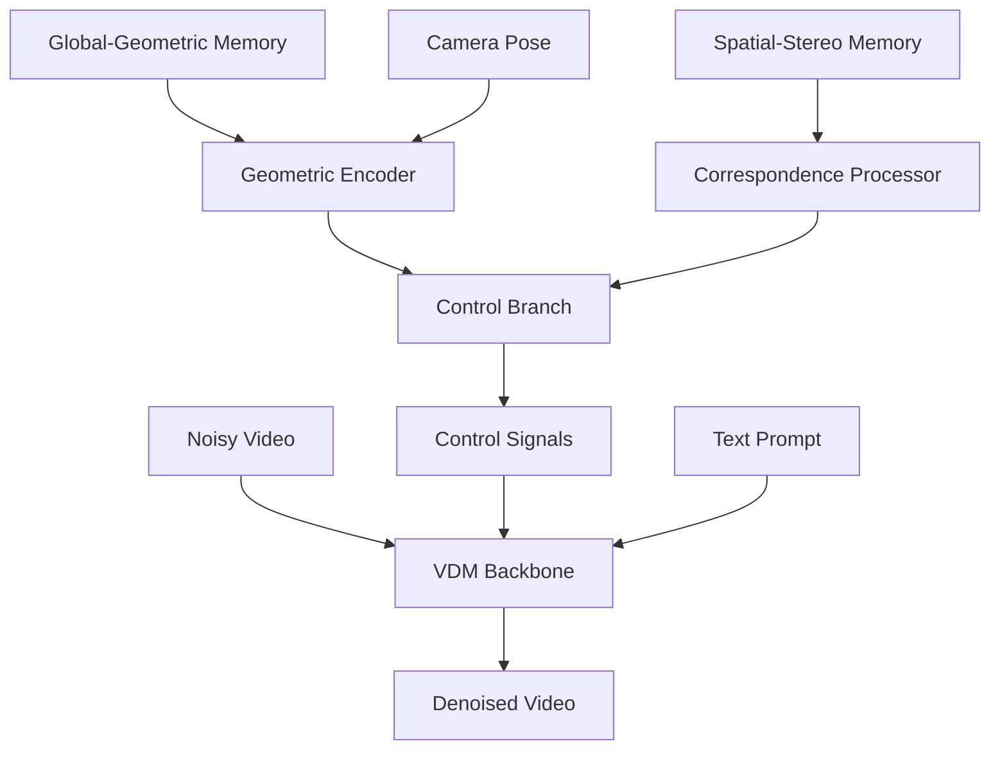

## Overview

WorldStereo builds upon a **Video Diffusion Model (VDM)** backbone with a specialized **control branch** architecture. This design enables geometric control over video generation while maintaining the visual quality and generative capabilities of foundational video diffusion models.

<Note>
A key innovation is that WorldStereo achieves geometric control **without joint training** of the backbone and control components, enabling efficient integration with pre-trained VDM models.
</Note>

## Video Diffusion Model Backbone

### Foundation: Distribution Matching Distillation

WorldStereo's backbone is built on a **distribution matching distilled VDM**, which offers significant advantages:

<CardGroup cols={2}>
  <Card title="High Quality" icon="star">
    Maintains the visual quality of large foundational video diffusion models
  </Card>
  
  <Card title="Efficiency" icon="bolt">
    Distillation reduces inference time while preserving generation capabilities
  </Card>
  
  <Card title="Stable Training" icon="balance-scale">
    Distribution matching provides stable distillation objectives
  </Card>
  
  <Card title="Generalization" icon="arrows-split-up-and-left">
    Inherits the broad generalization capabilities of the teacher model
  </Card>
</CardGroup>

### What is Distribution Matching Distillation?

<Accordion title="Distillation Overview">
**Model distillation** transfers knowledge from a large teacher model to a smaller, more efficient student model.

In the context of video diffusion:
- **Teacher**: Large, slow, high-quality VDM
- **Student**: Smaller, faster VDM backbone
- **Goal**: Maintain quality while improving efficiency
</Accordion>

<Accordion title="Distribution Matching">
**Distribution matching** ensures the student model's output distribution matches the teacher's:

```python
# Conceptual objective
minimize(
  distance(
    distribution(student_outputs),
    distribution(teacher_outputs)
  )
)
```

This approach ensures the distilled model generates videos with similar statistical properties to the teacher, preserving quality and diversity.
</Accordion>

<Accordion title="Benefits for WorldStereo">
The distilled VDM backbone provides:

1. **Fast inference**: Essential for generating long video sequences
2. **High quality**: Maintains visual fidelity needed for 3D reconstruction
3. **Pre-trained weights**: Can leverage existing foundational models
4. **Compatibility**: Works with the flexible control branch without retraining
</Accordion>

### VDM Architecture Components

The video diffusion backbone consists of:

<Accordion title="Temporal-Spatial Attention Layers">
Processes video data with both spatial and temporal dimensions:

- **Spatial attention**: Models relationships within each frame
- **Temporal attention**: Models motion and changes across frames
- **3D convolutions**: Processes spatial-temporal neighborhoods

These layers learn rich video representations from training data.
</Accordion>

<Accordion title="Noise Prediction Network">
Core diffusion mechanism:

1. Takes noisy video as input
2. Predicts noise to be removed
3. Enables iterative denoising to generate clean video

The noise prediction network is where geometric control signals are integrated.
</Accordion>

<Accordion title="Conditioning Mechanisms">
Supports various conditioning inputs:

- **Text prompts**: Semantic control over content
- **Image inputs**: Starting frames or reference images
- **Temporal controls**: Frame rate, duration
- **Geometric controls**: From WorldStereo's control branch
</Accordion>

## Control Branch Architecture

The **control branch** is WorldStereo's key architectural innovation for integrating geometric memory with video generation.

<Info>
The control branch-based design allows WorldStereo to add geometric control to pre-trained VDMs without requiring joint training, significantly reducing computational costs and improving flexibility.
</Info>

### Control Branch Purpose

The control branch serves to:

1. **Process geometric information** from memory modules
2. **Generate control signals** compatible with the VDM backbone
3. **Inject constraints** into the generation process
4. **Maintain separation** between geometric and generative components

### Architecture Overview



### Control Branch Components

<Accordion title="Geometric Encoder">
Processes information from the global-geometric memory:

**Inputs**:
- Point cloud from global-geometric memory
- Target camera pose
- Scene extent and scale information

**Processing**:
1. Project point cloud to target view
2. Rasterize to 2D feature maps
3. Extract multi-scale geometric features
4. Encode camera parameters

**Outputs**:
- Geometric feature maps at multiple resolutions
- Camera-conditioned embeddings
</Accordion>

<Accordion title="Correspondence Processor">
Handles spatial-stereo memory information:

**Inputs**:
- Feature memory bank from spatial-stereo memory
- 3D correspondence information
- Target view parameters

**Processing**:
1. Query memory bank for relevant features
2. Warp features to target view using correspondences
3. Generate attention masks based on geometric constraints
4. Extract fine-grained detail features

**Outputs**:
- Correspondence-warped features
- Attention constraint masks
- Detail preservation signals
</Accordion>

<Accordion title="Control Signal Generator">
Combines processed geometric information into control signals:

**Integration**:
- Fuses coarse geometric features with fine detail features
- Generates multi-scale control signals
- Produces modulation parameters for VDM layers

**Output Formats**:
- **Additive control**: Features added to VDM activations
- **Multiplicative control**: Scale factors for VDM features
- **Attention modulation**: Modifications to attention patterns
- **Conditioning vectors**: Global context for the VDM
</Accordion>

### Control Injection Points

Control signals are injected at multiple points in the VDM:

<CardGroup cols={2}>
  <Card title="Early Layers" icon="layer-group">
    Coarse geometric structure from global-geometric memory influences initial processing
  </Card>
  
  <Card title="Middle Layers" icon="diagram-project">
    Balanced geometric and semantic information guides generation direction
  </Card>
  
  <Card title="Late Layers" icon="brush">
    Fine-grained details from spatial-stereo memory refine output
  </Card>
  
  <Card title="Attention Layers" icon="arrows-to-eye">
    Correspondence constraints modify attention receptive fields
  </Card>
</CardGroup>

## No Joint Training Required

A crucial advantage of WorldStereo's design is that it operates **without joint training** of the VDM backbone and control branch.

### What Does "No Joint Training" Mean?

<Note>
**Joint training** would require simultaneously optimizing both the VDM backbone and control branch from scratch or with fine-tuning. WorldStereo avoids this by using a frozen or minimally adapted backbone with a separately trained control branch.
</Note>

### Benefits of Separate Training

<CardGroup cols={2}>
  <Card title="Efficiency" icon="clock">
    Avoids expensive retraining of large VDM backbones
  </Card>
  
  <Card title="Flexibility" icon="arrows-left-right">
    Can swap different VDM backbones without retraining entire system
  </Card>
  
  <Card title="Stability" icon="shield">
    Preserves proven generation quality of pre-trained VDMs
  </Card>
  
  <Card title="Modularity" icon="cubes">
    Control branch and geometric memories can be improved independently
  </Card>
</CardGroup>

### How It Works Without Joint Training

The control branch-based design achieves this through:

1. **Compatible control signals**: Control branch outputs are designed to be compatible with standard VDM architectures
2. **Minimal adaptation**: VDM backbone requires at most lightweight adaptation layers
3. **Plug-and-play integration**: Control signals can be injected into existing VDM attention and feature layers
4. **Independent optimization**: Control branch is trained to generate geometrically-consistent control signals without modifying the VDM

<Accordion title="Training Strategy">
WorldStereo uses a multi-stage training approach:

**Stage 1**: Train control branch with frozen VDM
- VDM backbone weights are frozen
- Only control branch parameters are updated
- Loss functions ensure geometric consistency

**Stage 2** (optional): Lightweight adaptation
- Small adapter layers in VDM are fine-tuned
- Core VDM weights remain frozen
- Improves integration without full retraining

**Stage 3**: Memory module refinement
- Geometric memory components are optimized
- VDM and control branch may be frozen
- Focuses on correspondence quality and point cloud accuracy
</Accordion>

## Integration of Geometric Memories

The control branch seamlessly integrates both geometric memory modules:

### Hierarchical Feature Fusion

```python
# Conceptual feature fusion in control branch
def generate_control_signals(global_memory, spatial_memory, camera_pose):
  # Process coarse structure
  coarse_features = geometric_encoder(
    point_cloud=global_memory.point_cloud,
    camera=camera_pose
  )
  
  # Process fine details
  fine_features, attention_masks = correspondence_processor(
    memory_bank=spatial_memory.memory_bank,
    correspondences=spatial_memory.correspondences,
    camera=camera_pose
  )
  
  # Fuse multi-scale information
  control_signals = control_fusion(
    coarse=coarse_features,
    fine=fine_features,
    attention_constraints=attention_masks
  )
  
  return control_signals
```

### Multi-Scale Control

Control signals operate at multiple scales:

<CardGroup cols={3}>
  <Card title="Global Scale" icon="earth">
    Overall scene structure from global-geometric memory
  </Card>
  
  <Card title="Object Scale" icon="cube">
    Mid-level features and object boundaries
  </Card>
  
  <Card title="Local Scale" icon="magnifying-glass">
    Fine details from spatial-stereo memory
  </Card>
</CardGroup>

This multi-scale approach ensures both coarse consistency and fine detail preservation.

## Generation Process

The complete video generation process with geometric control:

### Iterative Denoising with Control

<Accordion title="Step 1: Initialization">
**Input preparation**:
- Start with noise or partially noised input image
- Prepare camera trajectory for video sequence
- Initialize geometric memories from input image

**Memory setup**:
- Global-geometric: Initial point cloud from input
- Spatial-stereo: Empty memory bank (populated during generation)
</Accordion>

<Accordion title="Step 2: Frame Generation Loop">
**For each frame in the sequence**:

```python
for frame_idx, camera_pose in enumerate(camera_trajectory):
  # Generate control signals from geometric memories
  control = control_branch(
    global_memory=global_geometric_memory,
    spatial_memory=spatial_stereo_memory,
    camera=camera_pose
  )
  
  # Run diffusion denoising with control
  frame = vdm_backbone.denoise(
    noise=current_noise,
    control=control,
    num_steps=denoising_steps
  )
  
  # Update geometric memories with new frame
  global_geometric_memory.update(frame, camera_pose)
  spatial_stereo_memory.update(frame, camera_pose)
  
  # Proceed to next frame
  current_noise = prepare_next_noise(frame)
```
</Accordion>

<Accordion title="Step 3: Memory Updates">
**After each frame generation**:

1. **Extract 3D information**: Estimate depth and 3D structure from generated frame
2. **Update point cloud**: Add new points to global-geometric memory
3. **Store features**: Add fine-grained features to spatial-stereo memory
4. **Compute correspondences**: Establish 3D correspondences with previous frames

These updates enable incremental improvement of geometric guidance.
</Accordion>

<Accordion title="Step 4: Output">
**Final output**:
- Multi-view-consistent video sequence
- Updated geometric memories containing full scene structure
- 3D point cloud suitable for reconstruction
- Dense correspondences for multi-view stereo
</Accordion>

## Flexibility and Extensibility

The control branch-based design provides significant flexibility:

### Backbone Compatibility

<Info>
The control branch can work with different VDM backbones, including various architectures, model sizes, and training datasets.
</Info>

Supported variations:
- Different temporal modeling approaches (3D conv, transformers, etc.)
- Various resolution and frame rate configurations
- Multiple conditioning modalities

### Extension Possibilities

The architecture can be extended with:

<CardGroup cols={2}>
  <Card title="Additional Control Signals" icon="plus">
    Integrate other control modalities (depth, edges, semantic masks)
  </Card>
  
  <Card title="Enhanced Memory Modules" icon="microchip">
    Upgrade geometric memory representations
  </Card>
  
  <Card title="Multi-Scale Generation" icon="layer-group">
    Generate at multiple resolutions simultaneously
  </Card>
  
  <Card title="Interactive Control" icon="hand-pointer">
    Support user-guided editing of geometric memories
  </Card>
</CardGroup>

### Modular Improvements

Each component can be improved independently:

- **VDM backbone**: Upgrade to newer, better foundational models
- **Control branch**: Enhance geometric processing
- **Global memory**: Improve point cloud representation
- **Spatial memory**: Better correspondence algorithms

## Advantages for Camera-Guided Generation

The VDM + control branch architecture specifically benefits camera-guided video generation:

### Precise Camera Control

<Note>
By explicitly processing camera parameters in the control branch, WorldStereo achieves precise control over camera trajectories—a significant improvement over foundational VDMs that have limited camera controllability.
</Note>

**Control mechanisms**:
- Camera pose encoding in geometric encoder
- View-dependent feature projection
- Trajectory-aware temporal modeling

### Multi-View Consistency

The geometric control ensures consistency:

1. **Global-geometric memory** provides shared 3D structure across views
2. **Spatial-stereo memory** enforces local correspondence
3. **Control branch** translates geometric constraints into generation guidance
4. **VDM backbone** generates visually coherent frames respecting constraints

### Quality-Efficiency Balance

<CardGroup cols={2}>
  <Card title="Quality" icon="star">
    Maintains high visual quality through distilled VDM backbone
  </Card>
  
  <Card title="Efficiency" icon="gauge">
    Achieves efficiency through distillation and no joint training requirement
  </Card>
</CardGroup>

## Technical Considerations

### Control Signal Design

Effective control signals must:

- Be compatible with VDM architecture
- Encode geometric information effectively
- Allow gradient flow during training
- Not overwhelm generative capabilities

### Balance of Control and Generation

The system balances:

- **Strong control**: Ensures geometric consistency
- **Generation freedom**: Allows realistic texture and appearance synthesis
- **Flexibility**: Handles regions without strong geometric priors

<Info>
This balance is achieved through careful design of control signal strength, injection points, and fallback mechanisms when geometric information is uncertain.
</Info>

### Computational Efficiency

Efficiency optimizations include:

- Distilled VDM backbone (faster than full models)
- Efficient geometric processing in control branch
- Sparse attention enabled by correspondence constraints
- Incremental memory updates (avoid reprocessing)

## Next Steps

- Learn about the [Global-Geometric Memory](/concepts/global-geometric-memory) module
- Explore [Spatial-Stereo Memory](/concepts/spatial-stereo-memory) for detail control
- Review the complete [Architecture Overview](/concepts/overview)
